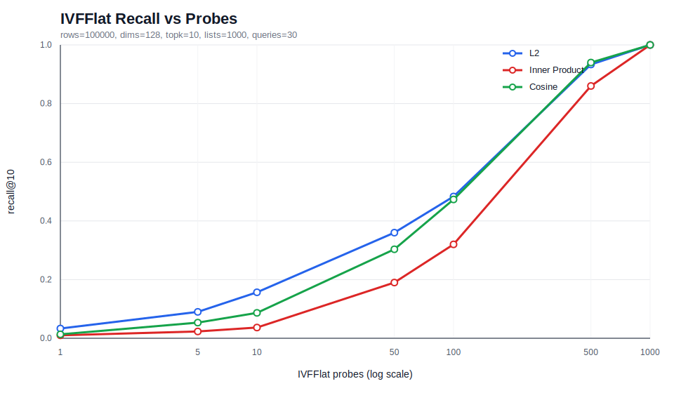
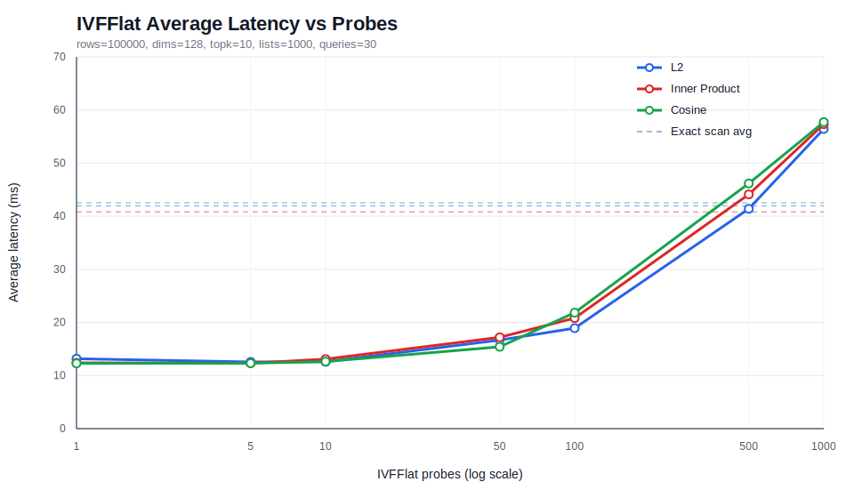
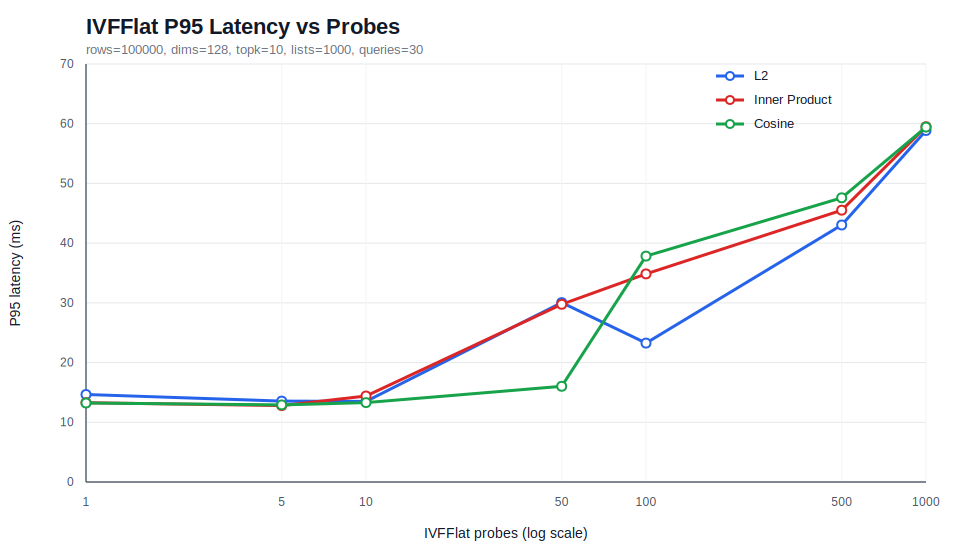

# pgvector 查询性能优化开发技术报告

## 1. 项目方向

本阶段选择“项目一：向量检索插件 pgvector 查询性能优化”作为主实施方向，围绕 L2、Inner Product、Cosine 三类距离场景，对 IVFFlat `lists/probes` 参数、召回率与查询延迟之间的关系建立可复现 benchmark，并形成后续优化 PR 的验证基线。

项目二“向量索引构建与诊断能力增强”作为扩展问题纳入记录。本次实测中已经发现 IVFFlat 大参数建索引会受到 `maintenance_work_mem` 限制，且安装包默认日志配置存在磁盘风险，均已沉淀为工程修复点。

## 2. 开发与验证环境

- 本地仓库：`/Users/blackevil/Documents/申请书/OpenTenBase-Packages`
- 本地 OpenTenBase 源码：`/Users/blackevil/Documents/申请书/OpenTenBase-source`
- 远程服务器：CloudStudio Ubuntu 24.04，64 CPU，8GB 内存，约 31GB 根分区
- OpenTenBase 安装方式：`OpenTenBase-Packages` APT 仓库安装
- 已安装组件：`opentenbase`、`opentenbase-server`、`opentenbase-client`、`opentenbase-contrib`、`libopentenbase-dev`
- 集群形态：单机 GTM + Coordinator + Datanode

节点状态验证：

```text
gtm:   RUNNING
dn1:   RUNNING
coord: RUNNING
```

`vector` 扩展和基础距离查询已验证可用。

## 3. 开发产物

### 3.1 pgvector IVFFlat Benchmark 工具

已新增源码补丁：

```text
patches/pgvector-ivfflat-benchmark-tools.patch
```

补丁内容新增：

```text
contrib/pgvector/bench/README.md
contrib/pgvector/bench/ivfflat_benchmark.sql
contrib/pgvector/bench/run_ivfflat_benchmark.sh
contrib/pgvector/bench/ivfflat_recommendation.sql
```

工具能力：

- 覆盖 L2、Inner Product、Cosine 三种距离类型。
- 支持 `ROWS`、`DIMS`、`QUERIES`、`TOPK`、`LISTS`、`PROBES_LIST` 配置。
- 输出 `avg_latency_ms`、`p95_latency_ms`、`recall_at_k`、`exact_avg_latency_ms`。
- 自动生成每个 metric 的 `EXPLAIN` plan 文件，确认是否走 IVFFlat 索引。
- 支持 `MAINTENANCE_WORK_MEM`，避免大规模 IVFFlat 建索引因默认 64MB 内存失败。

### 3.2 IVFFlat 参数推荐与诊断函数

已新增 `ivfflat_recommendation.sql`，提供：

```sql
SELECT *
FROM pgvector_bench.recommend_ivfflat_params(
  row_count => 100000,
  dims => 128,
  target_recall => 0.90,
  metric => 'cosine'
);
```

远程 OpenTenBase 实测返回：

| 输入 | 推荐结果 | 数据来源 |
| --- | --- | --- |
| `100000, 128, 0.90, cosine` | `lists=1000, probes=500, recall=0.9400, avg_latency=46.164ms, maintenance_work_mem=512MB` | 实测观测 |
| `100000, 128, 0.90, ip` | `lists=1000, probes=1000, recall=1.0000, avg_latency=57.330ms, maintenance_work_mem=512MB` | 实测观测 |
| `250000, 256, 0.95, ip` | `lists=1600, probes=1380, maintenance_work_mem=1GB` | 启发式 |

推荐函数策略：

- 优先使用已沉淀的 benchmark 观测数据，选择满足目标 recall 的最低平均延迟参数。
- 无观测数据时返回保守启发式建议，并将 `recommendation_source` 标记为 `heuristic`。
- 输出 `risk_level`，提示该推荐适合直接采用、需要复测，还是存在低召回风险。

### 3.3 安装包日志安全修复

实测中发现单机环境下 datanode 会持续产生：

```text
WARNING: failed to connect to forward receiver, name=coord1
```

该日志曾使 `/var/log/opentenbase/dn1.log` 膨胀到约 32GB。已在安装包仓库中补充 `opentenbase-ctl init` 写入的日志轮转参数：

```text
log_rotation_size = '100MB'
log_truncate_on_rotation = on
```

修改文件：

```text
scripts/opentenbase-ctl
config/opentenbase-ctl
```

该修复不改变数据库功能行为，只限制日志文件无限增长风险。

## 4. Benchmark 方法

正式 benchmark 命令：

```bash
cd /workspace/OpenTenBase/contrib/pgvector
PATH=/usr/lib/opentenbase/5.0/bin:$PATH \
PGHOST=127.0.0.1 PGPORT=5432 PGUSER=opentenbase DBNAME=postgres \
ROWS=100000 DIMS=128 QUERIES=30 TOPK=10 LISTS=1000 \
PROBES_LIST="1 5 10 50 100 500 1000" \
METRICS="l2 ip cosine" MAINTENANCE_WORK_MEM=512MB \
bench/run_ivfflat_benchmark.sh
```

数据说明：

- 向量规模：100000 行
- 向量维度：128
- 查询数量：30
- TopK：10
- IVFFlat lists：1000
- probes：1、5、10、50、100、500、1000
- 数据生成：固定随机种子，便于复现
- 查询方式：approx 查询启用 IVFFlat，exact 查询禁用索引用于 recall 对照

结果文件：

```text
docs/benchmark-data/ivfflat_benchmark_20260621_110256.csv
docs/benchmark-data/ivfflat_benchmark_20260621_110256_plans.txt
```

图表：

```text
docs/figures/pgvector-recall-vs-probes.svg
docs/figures/pgvector-avg-latency-vs-probes.svg
docs/figures/pgvector-p95-latency-vs-probes.svg
```







## 5. EXPLAIN 验证

三种距离场景均确认走 IVFFlat 索引：

```text
metric=l2      -> Index Scan using items_embedding_ivfflat_idx on items
metric=ip      -> Index Scan using items_embedding_ivfflat_idx on items
metric=cosine  -> Index Scan using items_embedding_ivfflat_idx on items
```

开发过程中发现一个关键问题：如果查询写成：

```sql
ORDER BY embedding <-> '[...]', id
```

则 IVFFlat 不能被选中，计划会退回 `Seq Scan + Sort`。正式 benchmark 已修正为只按向量距离表达式排序：

```sql
ORDER BY embedding <-> '[...]'
```

因此早期未修正二级排序前的 smoke 数据只作为环境验证记录，不作为性能结论。

## 6. 正式实测结果

| metric | probes | avg_latency_ms | p95_latency_ms | recall@10 | exact_avg_latency_ms |
| --- | ---: | ---: | ---: | ---: | ---: |
| l2 | 1 | 13.170 | 14.657 | 0.0333 | 41.951 |
| l2 | 5 | 12.563 | 13.554 | 0.0900 | 41.951 |
| l2 | 10 | 12.593 | 13.493 | 0.1567 | 41.951 |
| l2 | 50 | 16.681 | 30.044 | 0.3600 | 41.951 |
| l2 | 100 | 18.920 | 23.268 | 0.4833 | 41.951 |
| l2 | 500 | 41.396 | 43.030 | 0.9333 | 41.951 |
| l2 | 1000 | 56.440 | 58.867 | 1.0000 | 41.951 |
| ip | 1 | 12.398 | 13.287 | 0.0100 | 40.791 |
| ip | 5 | 12.333 | 12.793 | 0.0233 | 40.791 |
| ip | 10 | 13.102 | 14.404 | 0.0367 | 40.791 |
| ip | 50 | 17.204 | 29.752 | 0.1900 | 40.791 |
| ip | 100 | 20.818 | 34.842 | 0.3200 | 40.791 |
| ip | 500 | 44.110 | 45.518 | 0.8600 | 40.791 |
| ip | 1000 | 57.330 | 59.492 | 1.0000 | 40.791 |
| cosine | 1 | 12.292 | 13.238 | 0.0133 | 42.526 |
| cosine | 5 | 12.331 | 12.919 | 0.0533 | 42.526 |
| cosine | 10 | 12.626 | 13.300 | 0.0867 | 42.526 |
| cosine | 50 | 15.399 | 16.031 | 0.3033 | 42.526 |
| cosine | 100 | 21.845 | 37.830 | 0.4733 | 42.526 |
| cosine | 500 | 46.164 | 47.589 | 0.9400 | 42.526 |
| cosine | 1000 | 57.717 | 59.441 | 1.0000 | 42.526 |

## 7. 结论与参数建议

1. `probes` 是当前 IVFFlat 查询最关键的召回率/延迟调节参数。`probes=1/5/10` 延迟最低，但 recall@10 明显不足，不适合质量敏感场景。
2. 在本次 100000 x 128d 数据上，`probes=500` 是较好的质量优先折中点：L2 recall@10 为 0.9333，Cosine 为 0.9400，平均延迟接近 exact scan。
3. `probes=1000` 等价于扫描全部 lists，recall@10 达到 1.0，但平均延迟升至约 56-58ms，高于 exact scan 的 40-43ms，不适合作为默认查询参数。
4. IP 场景在低 probes 下召回率最低，说明 Inner Product 更依赖较高 probes 或更合理的数据归一化/索引参数选择。
5. 对线上默认建议：先以 `lists=sqrt(rows)` 到 `rows/100` 量级做建索引起点，再用 benchmark 按目标 recall 选择 `probes`；本次数据中可优先评估 `probes=100/500` 两档。

## 8. 已发现问题与修复建议

| 问题 | 影响 | 当前处理 |
| --- | --- | --- |
| benchmark 查询增加 `ORDER BY ..., id` 会导致 IVFFlat 不被选中 | 性能数据失真 | 已在 benchmark 工具中移除二级排序，并输出 plan 证据 |
| `maintenance_work_mem=64MB` 无法构建 100000 行、lists=1000 的 IVFFlat 索引 | 大规模 benchmark 或用户建索引失败 | 已新增 `MAINTENANCE_WORK_MEM` 参数，正式测试使用 512MB |
| 单机环境 datanode WARNING 日志可能无限增长 | 根分区被写满，影响数据库和 benchmark | 已为安装包控制脚本增加日志轮转参数 |
| CloudStudio Docker daemon 无法启动 | 无法使用 docker-compose 路线 | 已改用 APT 安装路线完成验证 |

## 9. 后续优化方向

下一阶段建议从两条线继续：

1. 查询性能优化：继续分析 pgvector IVFFlat 扫描路径和距离计算路径，在不降低 recall 的前提下减少高 probes 场景下的 CPU 消耗。
2. 诊断能力增强：把本次 benchmark 中暴露出的 `maintenance_work_mem`、`lists/probes`、低召回风险、plan 是否命中 IVFFlat 等检查固化为诊断 SQL 或脚本。

本阶段已经完成可复现基线、三类 metric 的正式数据、图表、plan 证据、benchmark 补丁和安装包日志修复补丁，可作为后续 C 代码优化 PR 的评测基准。

## 10. 面向开源交稿的增强计划

为更贴合腾讯犀牛鸟开源课题对“工程深度、可验证性、可推广性”的评价，本项目后续按以下路线继续推进：

| 方向 | 目标 | 可交付物 | 验收标准 |
| --- | --- | --- | --- |
| 参数推荐 | 从数据展示升级为可执行推荐 | `recommend_ivfflat_params`、观测表、参数说明 | 对实测配置返回 measured 推荐；未知配置返回 heuristic 且提示复测 |
| 性能画像 | 找到 L2/IP/Cosine 查询热点 | `perf` 火焰图、热点函数清单、优化候选 | 明确 CPU 时间主要消耗在距离计算、IVFFlat 扫描或分布式执行哪一层 |
| 内核优化 | 降低高 recall 场景延迟 | C 代码优化 PR 或实验分支 | 在 recall 不下降前提下，`probes=500/1000` 平均延迟下降 |
| 分布式观测 | 记录 Coordinator/Datanode 资源变化 | 诊断 SQL、运行手册 | 能定位索引构建内存不足、查询未命中索引、日志膨胀等问题 |
| 异常场景 | 验证低内存和非均匀数据分布 | 负向 benchmark、恢复记录 | 能复现低召回/构建失败并给出明确处理建议 |
